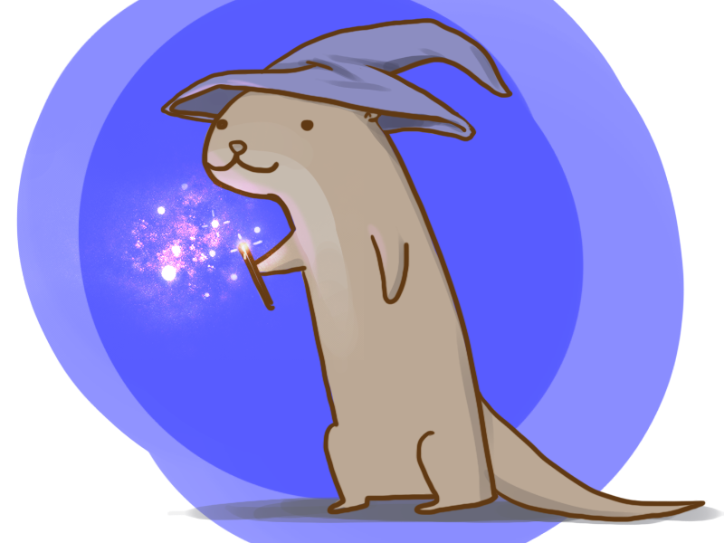

<!-- Improved compatibility of back to top link: See: https://github.com/othneildrew/Best-README-Template/pull/73 -->
<a name="readme-top"></a>
<!--
*** Thanks for checking out the Best-README-Template. If you have a suggestion
*** that would make this better, please fork the repo and create a pull request
*** or simply open an issue with the tag "enhancement".
*** Don't forget to give the project a star!
*** Thanks again! Now go create something AMAZING! :D
-->


<!-- PROJECT SHIELDS -->
<!--
*** I'm using markdown "reference style" links for readability.
*** Reference links are enclosed in brackets [ ] instead of parentheses ( ).
*** See the bottom of this document for the declaration of the reference variables
*** for contributors-url, forks-url, etc. This is an optional, concise syntax you may use.
*** https://www.markdownguide.org/basic-syntax/#reference-style-links
-->
<!-- 
[![Contributors][contributors-shield]][contributors-url]
[![Forks][forks-shield]][forks-url]
[![Stargazers][stars-shield]][stars-url]
[![Issues][issues-shield]][issues-url]
[![MIT License][license-shield]][license-url]
[![LinkedIn][linkedin-shield]][linkedin-url]
-->


<!-- PROJECT LOGO -->
<br />
<div align="center">
  
  <p style="color: #888888; font-size: 10px; margin-top: 5px;">Wizard Otter by arseniic</p>

  <h3 align="center">Hairy Otter</h3>

  <p align="center">
    Experience a magical world and cast spells in VR. 
  </p>
</div>


<!-- TABLE OF CONTENTS -->
<details>
  <summary>Table of Contents</summary>
  <ol>
    <li>
      <a href="#about-the-project">About The Project</a>
    </li>
    <li>
      <a href="#getting-started">Getting Started</a>
    </li>
    <li><a href="#current-features">Current Features</a></li>
    <li><a href="#roadmap">Roadmap</a></li>
    <li><a href="#contributions">Contributions</a></li>
    <li><a href="#acknowledgments">Acknowledgments</a></li>
  </ol>
</details>


<!-- ABOUT THE PROJECT -->
## About the Project

We're a team of UC Berkeley students (computer scientists, game developers, artists, and engineers) joined together to create an immersive and inspiring experience: spellcasting in virtual reality. 


### Demo 
**[05/06/2024](https://youtu.be/Zb6GGkSUL1M)**

[](https://youtu.be/Zb6GGkSUL1M)


### Built With
* [![Unity][Unity.com]][Unity-url]
* [![Meta][Meta.com]][Meta-url]
* [![Witai][Wit.ai]][Wit.ai-url]

<p align="right">(<a href="#readme-top">back to top</a>)</p>


<!-- GETTING STARTED -->
## Getting Started

Help improve the world of hairy otters! Follow these steps:

### Installation

1. Fork and clone the project
   ```sh
   git clone https://github.com/your_username_/hairy-otter.git
   ```
2. Install Unity packages 
  * XR
    * XR Interaction Toolkit
    * Oculus XR Plugin
    * XR Plugin Management
    * Meta Voice SDK
  * General
    * TextMeshPro
    * Unity UI
    * Universal RP
    * AI Navigation

### Contributing 

1. Fork the Project
2. Create your Feature Branch (git checkout -b feature/AmazingFeature)
3. Commit your Changes (git commit -m 'Add some AmazingFeature')
4. Push to the Branch (git push origin feature/AmazingFeature)
5. Open a Pull Request

<p align="right">(<a href="#readme-top">back to top</a>)</p>


<!-- GETTING STARTED -->
## Current Features

Refer to this section to learn the technical details of current features. 

### Voice Recognition and Spell Casting

We utilized the Voice SDK powered by Wit.ai to recognize voice commands. The user can activate and deactivate the voice service using quest controllers. 

**Current commands**
- _lumos_ - illuminates the wand 
- _nox_ - deilluminates the wand
- _attack_ - launch a fireball 
- _shield_ - create a shield 
- _book_ - spawn a book 


**Relevant scripts**
```
Assets/Scripts/
│   Spells.cs
│
└───VoiceSDK/
│   │   VoiceController.cs
│   │   CastSpellConduit.cs
│   │   ...
...
```

**Development Progress**

We initially implemented voice recognition using TensorFlow and sent the recognized voice command to the Unity application, which allowed us to build and deploy custom machine learning models. 

To keep our solution contained within Unity, we later switched to using Voice SDK provided by the Meta Quest. 

**References**

Learn how to use Voice SDK: 
* [Incoroporate Voice SDK into Unity - Medium](https://medium.com/taikonauten-magazine-english/unity-mixed-reality-tutorial-voice-sdk-5f875043ab0a)
* [Voice-enabled VR Unity App - GitHub](https://github.com/wit-ai/wit-unity/blob/main/Tutorials/ShapesTutorial.md)


<p align="right">(<a href="#readme-top">back to top</a>)</p>


<!-- ROADMAP -->
## Roadmap
- [x] Speech Recognition
- [x] Demo - 05/06/2024 (Meta Quest 2, Mac, Windows build, with basic spellcasting)
- [ ] Graphics 
    - [ ] 3D modeling and animation 
    - [ ] Post-processing (fog, lighting)
    - [ ] Shaders 
    - [ ] Water 
- [ ] AI & Machine Learning 
    - [ ] Gesture Recognition
    - [ ] Speech Recognition      
- [ ] Spells 
    - [ ] Wand grabbing skill (w/o wand) 
    - [ ] AR interaction (MR Utility Kit, passthrough layer) 
    - [ ] Spellbook 
- [ ] Minigames & Features
    - [ ] Broom riding (Quidditch)
    - [ ] Spell making
    - [ ] Potion making
    - [ ] Wand making
    - [ ] Shop (diagon alley)
    - [ ] Mythical animal taming
    - [ ] Sorting Hat 
    - [ ] Chess (life-sized, sorcerer's stone)
    - [ ] Platform 9 3/4
    - [ ] Unique enemy battles (basilisk, giant spider, dementor)
    - [ ] Dueling (npcs, lord voldemort)
    - [ ] Triwizard Tournament
    - [ ] Storymode
    - [ ] Multiplayer mode
- [ ] UI / UX
    - [ ] Inventory
    - [ ] Game menu
    - [ ] User flow

<p align="right">(<a href="#readme-top">back to top</a>)</p>


<!-- CONTRIBUTING -->
## Contributions

* Jonas So Gutierrez - Implemented VR hands, VR movement (continuous and teleport), VR grab, and flying
* Eugene Kang - Implemented spell casting, and player movement; Created game environment and target dummies
* Yena Kang - Created spellbook, animal summoning (expecto patronum); Integrated voice recognition models (TensorFlow) 
* Jaeha Yi - Implemented spell casting, VR movement, and enemies; Created game environment, UI, and demo; Integrated voice recognition models (TensorFlow, Wit.ai)
* John Yoon - Implemented projectile firing, wand movement; Integrated voice recognition models (TensorFlow)

<p align="right">(<a href="#readme-top">back to top</a>)</p>


<!-- ACKNOWLEDGMENTS -->
## Acknowledgments

Thank you to [XR@Berkeley](https://xr.studentorg.berkeley.edu/home/) for supporting our project! 

Resources we found helpful and utilized throughout our journey: 

XR
* [XR setup](https://xr.studentorg.berkeley.edu/decal/labs/oculus/lab1/)
* [XR movement](https://www.youtube.com/watch?v=Jvb7sAR2Tmk)

Voice SDK 
* [Incoroporate Voice SDK into Unity - Medium](https://medium.com/taikonauten-magazine-english/unity-mixed-reality-tutorial-voice-sdk-5f875043ab0a)
* [Voice-enabled VR Unity App - GitHub](https://github.com/wit-ai/wit-unity/blob/main/Tutorials/ShapesTutorial.md)

Features
* [Animal Summoning](https://www.youtube.com/watch?v=vMd5GnP5c8o)
* [Magic Effects](https://assetstore.unity.com/packages/vfx/particles/spells/magic-effects-free-247933)
* [Endless Book](https://assetstore.unity.com/packages/3d/props/endlessbook-134213)
* [Wand](https://assetstore.unity.com/packages/3d/props/weapons/3d-items-free-wand-pack-46225)

Game Environment
* [Dungeon](https://assetstore.unity.com/packages/3d/environments/dungeons/ultimate-low-poly-dungeon-143535)

<p align="right">(<a href="#readme-top">back to top</a>)</p>


<!-- MARKDOWN LINKS & IMAGES -->
<!-- https://www.markdownguide.org/basic-syntax/#reference-style-links -->
[product-screenshot]: images/screenshot.png
[Unity.com]: https://img.shields.io/badge/unity-000000?style=for-the-badge&logo=unity&logoColor=FFFFFF
[Unity-url]: https://unity.com/
[Meta.com]: https://img.shields.io/badge/Meta%20Quest-FFFFFF?style=for-the-badge&logo=meta&logoColor=0467DF
[Meta-url]: https://developer.oculus.com/
[Wit.ai]: https://img.shields.io/badge/wit.ai-B2E1FF?style=for-the-badge&logo=wit.ai
[Wit.ai-url]: https://wit.ai/

